<h1 align="center">Hi 👋, I'm Shivang Rai</h1>
<h3 align="center">Full-Stack Developer | AI Automation Engineer | Cloud & Data Enthusiast</h3>

  

---

---

## 🚀 About Me

I'm a Full-Stack Developer passionate about designing and building scalable, user-centric applications. I enjoy transforming complex problems into efficient software solutions and continuously exploring emerging technologies in AI, cloud computing, and distributed systems.

### What I Do
- 💻 Develop modern web applications using React, Node.js, and FastAPI
- 🤖 Build AI-powered tools, automation workflows, and intelligent systems
- 📊 Create data-driven platforms for analytics and decision support
- ☁️ Deploy and manage applications using AWS, Docker, and cloud technologies
- 🔧 Design secure, scalable backend architectures and APIs

### Currently Exploring
- 🌱 System Design & Software Architecture
- ☸️ Kubernetes & Container Orchestration
- 🔄 CI/CD & DevOps Automation
- ⚡ Backend Performance Optimization
- 🧠 Large Language Models (LLMs) & Agentic AI

### Career Goal
🎯 To build impactful, production-grade software and grow into a world-class Software Engineer.

## 🏆 Featured Projects

### 🚦 Traffic Intelligence System
Full-stack analytics platform for analyzing road accident and transport datasets using React, FastAPI, Pandas, and data visualization.

🔗 Live: https://intelligent-traffic.vercel.app/

### 📋 Yojna-Flow
Enterprise-grade Project Management System with RBAC, Kanban Boards, Sprint Planning, Analytics Dashboard, and Team Collaboration.

🔗 Live: https://yojnaflow.vercel.app/

### 💬 Real-Time Chat Application
Realtime messaging platform with Firebase, WebRTC, Voice/Video Calling, Presence Tracking, and End-to-End Encryption.

🔗 Live: https://chat-app-brown-zeta-84.vercel.app/

---

## 🎓 Education

**B.Tech – Computer Science & Information Technology**
Specialization in **Cloud Computing & Machine Learning**
Babu Banarasi Das University
Expected Graduation: May 2027

---

## 🏅 Achievements

- 🚀 Built and deployed multiple full-stack applications used in production environments
- 📈 Solved 300+ DSA problems across coding platforms
- 🔥 Experience working with Agile workflows, Git, GitHub, and CI/CD pipelines
- 🤝 Open Source Contributor and Collaborative Developer

---

## 📜 Certifications

- AWS Cloud Practitioner (Pursuing)
- DevOps & Cloud Computing Training
- Machine Learning & Data Analytics Coursework

---

## 🌐 Connect With Me

<a href="https://www.linkedin.com/in/shivang-rai11/" target="blank">LinkedIn</a> •
<a href="https://shivang-2005.vercel.app/" target="blank">Portfolio</a> •
<a href="mailto:raishivang69@gmail.com">Email</a>

## 📈 GitHub Stats

  
  
   
  

## 🔗 Connect With Me
- 💼 LinkedIn: https://www.linkedin.com/in/shivang-rai11/
- 📧 Email: raishivang69@gmail.com

---

⭐️ From [Shivang Rai](https://github.com/YOUR_USERNAME)

---
# Profile Shooter

---

### ✍️ Random Dev Quote

### LeetCode Progress

