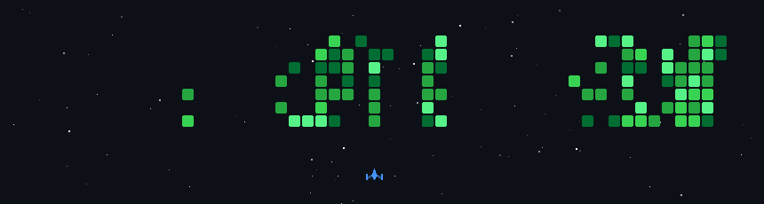

<h1 align="center">Hi 👋, I'm Shivang Rai</h1>
<h3 align="center">Aspiring Software Developer | Full Stack | Data Enthusiast</h3>

---
## 🚀 About Me
- 💻 Full-Stack Developer specializing in the **MERN stack & scalable backend systems**
- ⚡ Building **real-time applications** with focus on performance, security, and clean architecture  
- 📊 Strong interest in **Data Analysis & AI-driven solutions**  
- 🌱 Currently learning **System Design & Backend Optimization**  
- 🎯 Goal: Build production-level applications and crack top tech roles
---

## 🛠️ Tech Stack

### 💻 Frontend

---

### ⚙️ Backend

---

### 🧠 Programming Languages

---

### 🗄️ Databases

---

### 📊 Data Science / AI

---

### 🎨 Design Tools

---

### 🛠️ Tools & Platforms

---

## 📈 GitHub Stats

---

## 🔗 Connect With Me
- 💼 LinkedIn: [https://www.linkedin.com/in/shivang-rai11/]
- 📧 Email: [raishivang69@gmail.com]

---

⭐️ From [Shivang Rai](https://github.com/YOUR_USERNAME)

---
# Profile Shooter

---

### ✍️ Random Dev Quote

### LeetCode Progress

